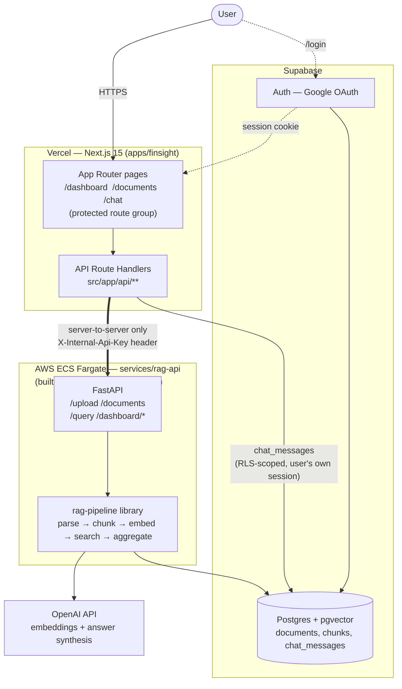

# FinSight

AI-powered personal finance assistant. Upload financial documents (bank
statements, receipts, CSV exports), ask questions about your finances in a
chat interface, and see an at-a-glance dashboard of income, spending, and
savings — all backed by a retrieval-augmented-generation (RAG) pipeline over
your own documents.

This is a pnpm monorepo with a TypeScript frontend/API layer and an
independent Python RAG backend.

## Contents

- [Architecture](#architecture)
- [Authentication](#authentication)
- [Repository layout](#repository-layout)
- [Prerequisites](#prerequisites)
- [Quick start](#quick-start)
- [Environment variables](#environment-variables)
- [Common commands](#common-commands)
- [API routes](#api-routes)
- [Testing](#testing)
- [Deployment status](#deployment-status)
- [Project docs](#project-docs)

## Architecture



Deliberate decisions worth calling out (see [`DECISIONS.md`](./DECISIONS.md) for the full log):

- **RAG backend is a separately deployable service**, not a Next.js API route — Python owns embeddings/vector search/LLM synthesis/dashboard aggregation, decoupled from the frontend's release cycle and runtime.
- **The RAG API is never reachable from the browser.** Next.js Route Handlers proxy to it server-to-server over a shared-secret `X-Internal-Api-Key` header, keeping `OPENAI_API_KEY` and Supabase service credentials off the client entirely.
- **Chat message durability is split from answer generation.** User/assistant messages are written straight to Supabase (`chat_messages`, RLS-scoped to the caller's own session) from the Next.js route, while the assistant's reply text comes from a separate call to the RAG API's `/query`. If the RAG API is down, the user's message still saves and a fallback reply is stored instead of losing the message.
- **Dashboard aggregates are computed on the RAG API** from real stored documents/transactions, behind a short-TTL cache to keep the dashboard responsive under repeated polling — not a Next.js-side mock store.
- **Auth and app data share one Supabase project** (Postgres + pgvector + Auth), avoiding a second identity provider for a demo-scale app.
- A LangGraph-based `/query/agent` endpoint (multi-turn conversation memory via a checkpointer) exists in `rag-api` alongside the plain `/query` used today, but isn't called by the frontend yet — built as a drop-in upgrade path, not wired up.

- **Frontend**: Next.js 15 (App Router), Tailwind CSS v4, TanStack Query, `next-intl` (Spanish default, English available), `sonner` toasts, `react-dropzone` uploads, `next-themes` for light/dark mode.
- **API**: Next.js Route Handlers (`src/app/api/**`), owns all `/api/*` routes.
- **RAG backend**: a standalone Python service pair — `rag-pipeline` (ingestion/search/aggregation library) and `rag-api` (FastAPI HTTP wrapper + OpenAI-powered answer synthesis) — with its own Supabase project and Python dependencies, decoupled from the rest of the monorepo.
- **Dashboard, documents, and chat** are all wired to the real RAG backend — there is no mock data path left in the frontend.

See [`DECISIONS.md`](./DECISIONS.md) for the day-to-day architecture-decisions log kept alongside this codebase.

## Authentication

Sign-in is Google OAuth via **Supabase Auth**:

- `/login` — sign-in page, redirects to Supabase's Google OAuth flow
- `/auth/callback` — OAuth callback route handler that exchanges the code for a session
- `(protected)/` route group — `dashboard`, `documents`, and `chat` are all gated behind this layout, which redirects unauthenticated visitors back to `/login`

Uses `@supabase/ssr` and `@supabase/supabase-js` for session handling on both server and client.

## Repository layout

```
.
├── apps/
│   └── finsight/           Next.js 15 frontend + API routes (the app itself)
├── lib/
│   ├── db/                 Drizzle schema/client (@workspace/db)
│   ├── api-spec/           OpenAPI spec + orval codegen config
│   └── api-zod/            Generated Zod schemas (@workspace/api-zod)
├── services/
│   ├── rag-pipeline/       Python: parse → chunk → embed → store → search → aggregate (Supabase/pgvector)
│   ├── rag-api/            Python: FastAPI wrapper over rag-pipeline + OpenAI synthesis, AWS CDK deploy artifacts
│   └── rag-eval/           Python: DeepEval-based RAG evaluation suite, runs against real services (excluded from default CI)
├── .claude/                Claude Code agents/skills configured for this repo
├── CLAUDE.md               Team workflow instructions for AI-assisted development
├── DECISIONS.md            Architecture/decisions notes
├── BACKLOG.md              Assignment checklist mapped to implementation status
└── AI_USAGE.md             Log of how AI tools were used to build this project
```

## Prerequisites

- **Node.js 24** and **pnpm** (this repo enforces pnpm via a `preinstall` guard — `npm install` will fail on purpose)
- **Python 3.11+** with `venv`, only if you're working on `services/rag-pipeline` or `services/rag-api`
- A **Supabase** project with the `pgvector` extension (for the RAG backend) — see [`services/rag-pipeline/README.md`](./services/rag-pipeline/README.md)
- API keys: **OpenAI** (embeddings and chat answer synthesis) — only needed if you're running the RAG backend against live services rather than mocks

## Quick start

Dashboard, documents, and chat all read from the RAG backend now — there's no
mock-data path left, so the frontend needs it running to show real data:

```bash
# 1. Install JS/TS dependencies
pnpm install

# 2. Set up the RAG backend (see services/rag-pipeline/README.md for Supabase setup)
cd services/rag-pipeline && python3 -m venv .venv && source .venv/bin/activate && pip install -e .
cd ../rag-api && pip install -e ../rag-pipeline -e ".[dev]"
cp .env.example .env   # fill in SUPABASE_URL, SUPABASE_SERVICE_KEY, OPENAI_API_KEY, INTERNAL_API_KEY
uvicorn rag_api.main:app --reload --port 8000

# 3. Point the frontend at it
cd ../../apps/finsight
cp .env.example .env.local   # RAG_API_BASE_URL + RAG_API_INTERNAL_KEY (must match rag-api's INTERNAL_API_KEY)

# 4. Run the frontend
pnpm --filter @workspace/finsight run dev
```

## Environment variables

| App | File | Key variables |
| --- | --- | --- |
| `apps/finsight` | `.env.local` (gitignored, copy from `.env.example`) | `RAG_API_BASE_URL`, `RAG_API_INTERNAL_KEY` |
| `services/rag-api` | `.env` (gitignored, copy from `.env.example`) | `SUPABASE_URL`, `SUPABASE_SERVICE_KEY`, `OPENAI_API_KEY`, `INTERNAL_API_KEY`, `AGENT_CHECKPOINT_DB_URL` (optional for local dev, falls back to SQLite; required before deploying via the CDK stack in `services/rag-api/infra/`) |
| `services/rag-pipeline` | `.env` (gitignored, copy from `.env.example`) | `SUPABASE_URL`, `SUPABASE_SERVICE_KEY`, `OPENAI_API_KEY` |

`RAG_API_INTERNAL_KEY` (frontend) and `INTERNAL_API_KEY` (rag-api) must be the
same value — it's a shared secret sent as the `X-Internal-Api-Key` header on
every server-to-server request. The RAG API is never called directly from
the browser.

## Common commands

Run from the repository root unless noted:

```bash
pnpm install                                       # install all workspace packages
pnpm run typecheck                                 # typecheck every package in the workspace
pnpm run build                                      # typecheck + build every package
pnpm --filter @workspace/finsight run dev           # frontend + API, http://localhost:$PORT
```

Python services (from within `services/rag-pipeline` or `services/rag-api`,
inside their respective virtualenv):

```bash
pytest                                              # rag-api and rag-pipeline test suites
python scripts/test_ingest_and_query.py             # rag-pipeline end-to-end sanity check (needs real credentials)
uvicorn rag_api.main:app --reload --port 8000       # run rag-api locally
```

## API routes

All under `/api`, served by Next.js Route Handlers (`src/app/api/**`):

| Method | Path | Description |
| --- | --- | --- |
| `GET` | `/api/healthz` | Health check |
| `GET` | `/api/documents` | List uploaded documents |
| `POST` | `/api/documents` | Upload a document (`multipart/form-data`) |
| `DELETE` | `/api/documents/:id` | Delete a document |
| `GET` | `/api/chat/messages` | Chat history |
| `POST` | `/api/chat/messages` | Send a message (returns user + assistant messages) |
| `GET` | `/api/dashboard/summary` | Income/spending/savings totals + category breakdown |
| `GET` | `/api/dashboard/activity` | Recent transactions list |

All of the above proxy server-side to the RAG backend (`services/rag-api`);
see its [endpoint table](./services/rag-api/README.md#endpoints) for what
happens behind that proxy. The `/api/chat/messages` routes additionally read
and write `chat_messages` directly in Supabase (message history persistence
is independent of the RAG API call that generates the assistant's reply).

## Testing

- **RAG pipeline / RAG API**: `pytest` in each service's virtualenv — all
  tests mock external calls (Supabase, OpenAI), so no live credentials are
  needed to run the suite.
- **Frontend / API routes**: `vitest` unit tests alongside the Next.js Route
  Handlers (`route.test.ts` files), plus `pnpm run typecheck` across the
  workspace, backed up by manual verification in a running dev server.
- Live end-to-end testing against real Supabase/OpenAI credentials and the
  actual AWS deployment have not been run in this environment — see
  [`BACKLOG.md`](./BACKLOG.md) for exactly what's verified vs. what still
  needs real credentials.

## Deployment status

- The frontend (with its Next.js API routes) is deployed to Vercel:
  [https://finsight-assistant.vercel.app](https://finsight-assistant.vercel.app/). `NEXT_PUBLIC_SUPABASE_URL` and
  `NEXT_PUBLIC_SUPABASE_ANON_KEY` are configured there; `RAG_API_BASE_URL`
  and `RAG_API_INTERNAL_KEY` are **not** set yet (rag-api isn't deployed —
  see below). Since `/dashboard`, `/documents`, and `/chat` all now call the
  RAG API for real data (no mock fallback remains), all three will show a
  soft error state on the deployed frontend until rag-api is deployed and
  those env vars are added to the Vercel project.
- AWS deployment artifacts for `rag-api` (ECS Fargate + CDK) are built and
  ready but have **not** been applied — no AWS credentials in this
  development environment. See
  [`services/rag-api/DEPLOYMENT.md`](./services/rag-api/DEPLOYMENT.md) for
  the manual deployment steps.

## Project docs

- [`CLAUDE.md`](./CLAUDE.md) — the team workflow this project follows for AI-assisted feature development (design → branch → implement → review → merge)
- [`DECISIONS.md`](./DECISIONS.md) — architecture decisions and gotchas, kept up to date as the codebase evolves
- [`BACKLOG.md`](./BACKLOG.md) — the original assignment checklist mapped to what's actually implemented/verified
- [`AI_USAGE.md`](./AI_USAGE.md) — a log of how AI tools were used to build this project
- [`services/rag-pipeline/README.md`](./services/rag-pipeline/README.md) — RAG ingestion/search library setup
- [`services/rag-api/README.md`](./services/rag-api/README.md) — RAG HTTP service setup, endpoints, Docker/AWS deploy
